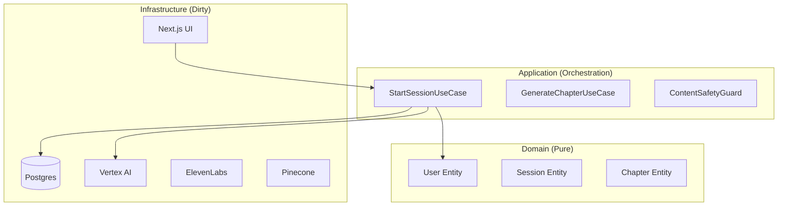

# 04. System Architecture

## 4.1 High-Level Overview

Recall follows a strict **Hexagonal Architecture (Ports & Adapters)** pattern. This is not a stylistic choice; it is a survival strategy. It ensures that our core value proposition (The Biographer's Logic) is immune to the volatility of the AI landscape.

### **Diagram**

---

## 4.2 Clean Architecture Layers

### **1. Core Domain (The Inner Circle)**
-   **Responsibility:** Defines *what* the business is. Entities (`User`, `Chapter`, `Session`), Value Objects (`Timezone`, `Email`), and Domain Services (`TimeFormatter`).
-   **Allowed Dependencies:** NONE. It cannot import from Application or Infrastructure.
-   **Forbidden Dependencies:** Databases, APIs, Frameworks.
-   **Failure Modes:** Logic errors here are catastrophic but rare due to high test coverage (100%).

### **2. Application Layer (The Orchestrator)**
-   **Responsibility:** Defines *what the system does*. Use Cases (`StartSession`, `ProcessMessage`). Defines **Ports** (Interfaces) that the outside world must meet.
-   **Allowed Dependencies:** Domain.
-   **Forbidden Dependencies:** Concrete implementations (e.g., `GeminiService`, `DrizzleRepository`). Must use Interfaces (`LLMPort`, `RepositoryPort`).
-   **Failure Modes:** Orchestration bugs (e.g., forgetting to save after generation).

### **3. Infrastructure Layer (The Dirty Details)**
-   **Responsibility:** Implements Ports. Talks to the messy real world. `GeminiAdapter`, `DrizzleRepository`, `Next.js API Routes`.
-   **Allowed Dependencies:** Application, Domain, External Libraries (`@google-cloud/vertexai`, `drizzle-orm`).
-   **Failure Modes:** Network timeouts, API rate limits, Database constraints. This layer *must* be defensive.

---

## 4.3 Trust Boundaries

1.  **Client vs. Server:**
    -   The Client (Browser) is untrusted.
    -   **ALL** input (Audio, Text, Images) is treated as potentially malicious.
    -   **Sanitization:** Happens at the API Route level (Zod parsing) before entering the Application Layer.

2.  **Application vs. AI:**
    -   The AI (Gemini) is a "Trusted but Hallucinating" component.
    -   **Output Validation:** We do not trust AI output blindly. We use "Safety Guards" and schema validation (JSON Mode) to enforce structure.
    -   **Prompt Injection:** We assume users will try to jailbreak. System Prompts include "Fencing" instructions.

3.  **Application vs. Database:**
    -   The DB is trusted storage.
    -   **Secrets:** Connection strings are injected via environment variables, never hardcoded.

---

## 4.4 Critical Data Flow

### **The "Thinking" Loop (Voice)**

1.  **Input:** User speaks -> Client buffers -> POST `/api/chat/speech-to-text`.
2.  **Boundary:** API validates User Session (JWT/Cookie).
3.  **App Layer:** `ProcessMessageUseCase` takes `text`.
4.  **Retrieval:** App calls `VectorStorePort` to get `relevant_memories`.
5.  **Reasoning:** App calls `LLMPort` (ReAct Agent) with Context + Input.
    -   *Agent:* "User seems sad. I should use the `empathy` tool."
6.  **Action:** Agent decides response text.
7.  **Synthesis:** App calls `SpeechPort` (TTS) -> Returns Audio Buffer.
8.  **Output:** Client plays Audio.
