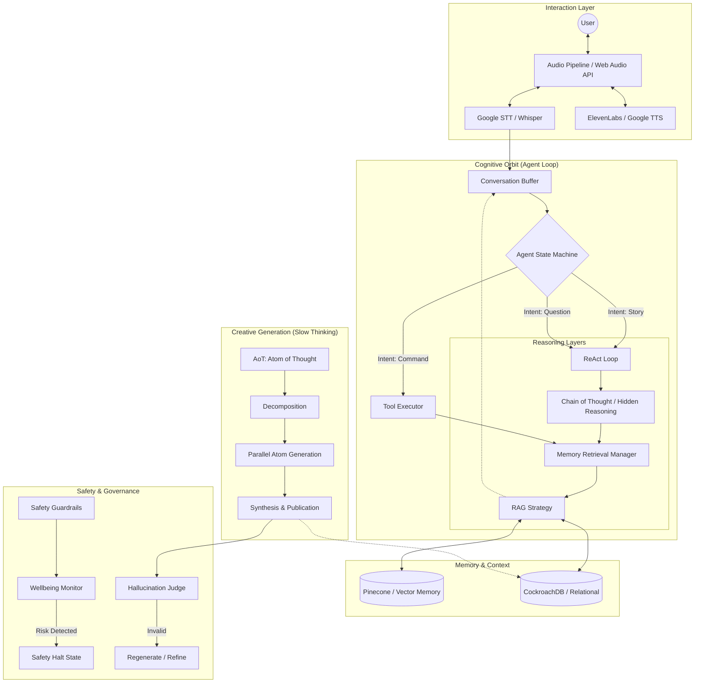

# Agentic AI Architecture: The Evermore Brain

Evermore's "intelligence" is not a single prompt, but a multi-layered cognitive architecture designed for safety, emotional resonance, and long-term memory.

## Architecture Visualization

## Core Components

### 1. The Agent State Machine (FSM)
The "Nervous System" of Evermore. It prevents the AI from falling into loops or losing track of the conversation's goal. It forces the agent to stay within deterministic guardrails.

### 2. The ReAct Loop (Reason + Act)
The "Frontal Lobe". Before Evermore speaks, it thinks. It decides if it needs to query past memories, save a new detail, or adjust its emotional tone.

### 3. Hidden Reasoning (CoT)
Evermore uses an internal monologue (`<thinking>` blocks) to plan its responses. This allows it to validate emotional safety and strategy before the user sees any text.

### 4. Semantic Episodic Memory (RAG)
The "Hippocampus". By using Pinecone vector embeddings, Evermore can remember a detail from three weeks ago as if it were said today, creating a true sense of continuity and relationship.

### 5. Atom of Thought (AoT)
The "Creative Cortex". Writing a book chapter is complex. AoT breaks the task into "Atoms" (Characters, Settings, Emotions), generates them independently, and synthesizes them into a coherent story only after each part is verified.

## Technology Stack

- **Reasoning**: Gemini 1.5 Pro (Vertex AI)
- **Voice**: ElevenLabs Turbo v2.5
- **Vector Memory**: Pinecone
- **Persistence**: CockroachDB / Drizzle ORM
- **Deployment**: Vercel Edge Functions
