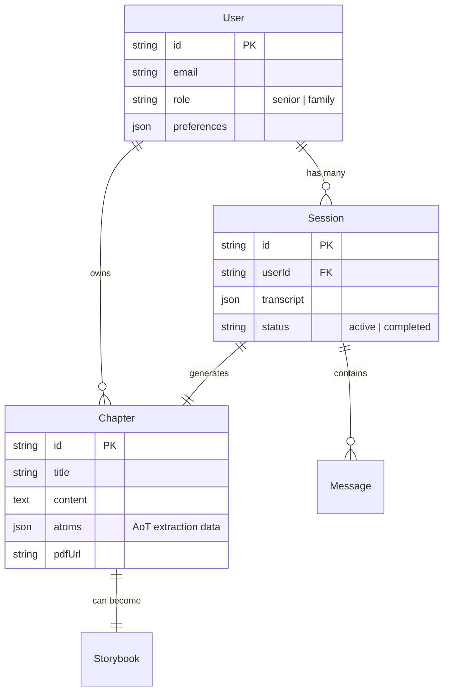

# Data Model

Recall uses a relational schema optimized for Agentic AI.

## ER Diagram (Conceptual)

- **User**: The senior or family member.
- **Session**: A conversation instance (chat).
- **Chapter**: A processed life story (output of a session).
- **Storybook**: A formatted, illustrated version of a chapter.

## Schema Definitions (Drizzle)

### Users Table
Stores identity and preferences.
- `id`: UUID
- `email`: String (Unique)
- `subscriptionTier`: "free" | "premium"

### Chapters Table
The core asset. Not just text, but structured metadata.
- `content`: The biographer-written text.
- `atoms`: JSON column storing the extracted "Atoms" (Key quotes, emotions, sensory details). This allows us to regenerate Storybooks without re-running the full analysis.

### Vectors (Pinecone)
We mirror `Chapter` content into Vector Storage for semantic search.
- **Metadata**: `{ userId, chapterId, keywords, emotion }`
- **Use Case**: The Biographer searches this to say "You mentioned your brother earlier..."
