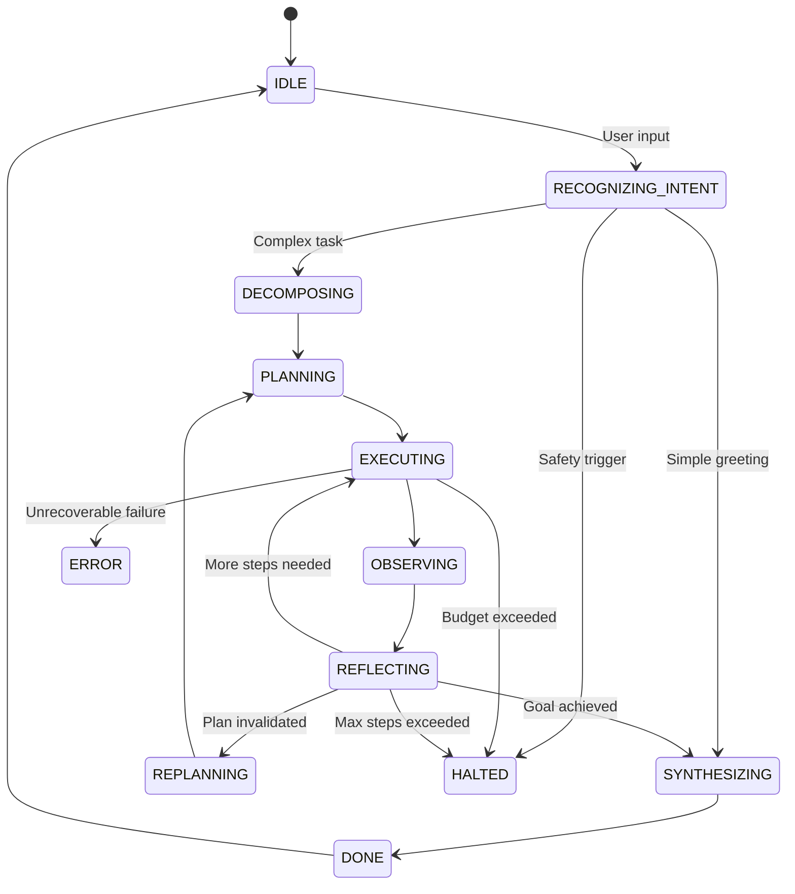

# Cognitive Architecture Canvas

> How Recall's agent reasons, plans, and decides.

---

## Purpose

This canvas defines the reasoning and decision-making architecture of Recall's agentic AI. It documents how the agent thinks, not how it is implemented. A Staff Engineer or AI Architect should understand the cognitive model, state transitions, and reasoning patterns from this document alone.

---

## Problems Solved

1. **Non-deterministic responses**: Raw LLM calls produce inconsistent outputs. The cognitive architecture imposes structure on reasoning.

2. **Unobservable thinking**: Without explicit states, debugging agent behavior is impossible. The FSM makes reasoning observable.

3. **Runaway execution**: Agents without bounds can loop indefinitely or exhaust tokens. The architecture enforces halting conditions.

4. **Premature answers**: LLMs often answer before gathering sufficient information. The architecture separates research from synthesis.

---

## Reasoning Pattern: ReAct with Algorithm of Thoughts

Recall uses a **ReAct** (Reason + Act) loop enhanced with **Algorithm of Thoughts (AoT)** planning.

### ReAct Loop

```
Observe → Think → Act → Observe → Think → ...
```

Each cycle:
1. **Observe**: Process observations from previous action (or initial user input)
2. **Think**: Reason about what to do next
3. **Act**: Execute a tool or generate output

### Algorithm of Thoughts Enhancement

Before entering the ReAct loop, complex goals are decomposed into explicit steps:

```
Goal → Decompose → Plan → Execute Steps → Synthesize
```

This prevents the agent from:
- Missing intermediate steps
- Jumping to conclusions
- Losing track of multi-step goals

### Why This Pattern

| Pattern | Strength | Why Recall Uses It |
|---------|----------|-------------------|
| Chain of Thought | Explicit reasoning traces | Yes, embedded in Think phase |
| ReAct | Tool use with reflection | Yes, core loop structure |
| AoT | Complex task decomposition | Yes, for multi-step goals |
| Tree of Thoughts | Multiple parallel reasoning paths | No, too expensive for real-time use |

---

## State Machine Model

The `EnhancedReActAgent` operates as a Finite State Machine (FSM) with explicit phases.

### Valid States

| State | Description |
|-------|-------------|
| `IDLE` | Agent is not processing |
| `RECOGNIZING_INTENT` | Classifying user input |
| `DECOMPOSING` | Breaking down complex goals (AoT) |
| `PLANNING` | Generating execution plan |
| `EXECUTING` | Running a tool or LLM call |
| `OBSERVING` | Processing execution results |
| `REFLECTING` | Evaluating if goal is met |
| `REPLANNING` | Adjusting plan based on observations |
| `SYNTHESIZING` | Generating final response |
| `DONE` | Agent has completed |
| `HALTED` | Agent stopped due to limits or safety |
| `ERROR` | Agent encountered unrecoverable error |

### State Transitions



### Failure States

| State | Trigger | Recovery |
|-------|---------|----------|
| `HALTED` | Budget exceeded | Return partial result with explanation |
| `HALTED` | Max steps exceeded | Return partial result with explanation |
| `HALTED` | Safety trigger | Return safety-appropriate response |
| `HALTED` | Timeout | Return partial result or prompt user |
| `ERROR` | Tool failure (unrecoverable) | Log error, return graceful failure message |

---

## Planning Horizon

### Simple Tasks

For simple tasks (greetings, short questions), planning is implicit:
- Single-step plan: `[SYNTHESIZE]`
- No decomposition phase

### Complex Tasks

For complex tasks, explicit step-by-step planning:

1. **Decomposition**: Break goal into `SubTask` objects
2. **Dependency mapping**: Identify which steps depend on others
3. **Plan generation**: Create `ExecutionPlan` with ordered `PlannedStep` objects
4. **Fallback planning**: Define contingencies for failure cases

Example decomposition:

```
Goal: "Tell me about my childhood home"

SubTasks:
1. Retrieve memories tagged 'childhood' or 'home' [RETRIEVAL]
2. Analyze memories for relevant details [ANALYSIS]
3. Generate empathetic narrative [GENERATION]
```

### Replan Triggers

| Trigger | Action |
|---------|--------|
| Tool returns no results | Broaden retrieval, try alternative tools |
| Tool fails | Retry with backoff, try fallback |
| Reflection shows goal not met | Add additional steps |
| Max replans exceeded | Return partial result with context |

---

## Atoms of Thought

Every reasoning step produces structured primitives.

### Observation

Result of tool execution or external input.

```typescript
interface ProcessedObservation {
  stepId: string;
  action: string;
  result: unknown;
  interpretation: string;
  relevantToGoal: boolean;
  confidenceScore: number;
}
```

### Hypothesis

Generated during planning and reflection.

```typescript
// Implicit in ReasoningTrace
interface Hypothesis {
  claim: string;
  evidence: string[];
  confidence: number;
}
```

### Action

Chosen tool or generation step.

```typescript
interface PlannedStep {
  id: string;
  order: number;
  action: string;
  tool?: string;
  input: Record<string, unknown>;
  expectedOutputType: string;
  onFailure: 'abort' | 'skip' | 'retry' | 'fallback';
}
```

### Critique

Self-evaluation during reflection.

```typescript
interface ReflectionResult {
  goalAchieved: boolean;
  summary: string;
  confidence: number;
  missingInformation?: string[];
  shouldReplan: boolean;
  replanReason?: string;
}
```

### Correction

Adjustments made during replanning.

```typescript
interface ReplanDecision {
  reason: string;
  newSteps: PlannedStep[];
  droppedSteps: string[];
  adjustedBudget?: number;
}
```

---

## Trade-offs

| Decision | Trade-off | Rationale |
|----------|-----------|-----------|
| FSM vs. free-form | Rigidity vs. consistency | Seniors need predictable, safe behavior |
| Explicit planning | Latency vs. reliability | Multi-step tasks fail without planning |
| Single ReAct loop | Simplicity vs. parallelism | Parallelism adds complexity without clear benefit |
| Max 5 steps default | Thoroughness vs. cost | Most conversations resolve in 2-3 steps |

---

## Why This Matters in Production

1. **Auditability**: Every state transition is logged. Debugging agent behavior is possible.

2. **Cost control**: The FSM enforces budget checks at every transition.

3. **Safety**: Wellbeing checks run at `RECOGNIZING_INTENT` and `REFLECTING` phases.

4. **User experience**: Seniors get consistent, predictable responses even when agents encounter issues.

5. **Maintainability**: New capabilities (tools, intents) plug into existing state machine without rewrites.
